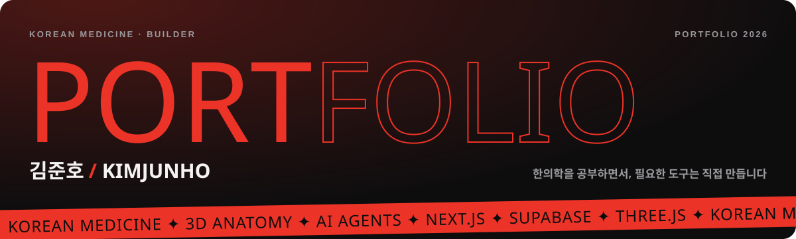

### 안녕하세요, 김준호입니다 👋

한의대 본과 3학년. 한의학을 공부하면서, 필요한 도구는 직접 만듭니다.
강의를 3D로 펼쳐 보는 해부학 뷰어, 과제·식단·알림을 챙기는 하루 비서, 콘텐츠를 만드는 AI 에이전트 팀까지 — 제가 매일 쓰는 것부터 만들고, 쓰면서 고칩니다.

  

#### 🛠 만드는 것

| | 프로젝트 | 한 줄 |
|---|---|---|
| 01 | **자비스 · 오늘 일정** | 마감까지 남은 날로 할 일을 나눠 '오늘 몫'을 계산하는 하루 관리 앱 |
| 02 | **재활 3D 해부학** | 강의 PDF와 3D 인체를 나란히 보는 학습 도구 (베타) |
| 03 | **품 의료차트** | 의료봉사 동아리 '품'의 진료 차트. 본진 때 AI가 같이 듣고 처방을 추천 |
| 04 | **AI 콘텐츠 팀** | 블로그·인스타·유튜브를 만드는 AI 에이전트 팀 |
| 05 | **소아과 써머리** | 강의 자료를 끌어다 놓으면 시험용 써머리를 만들어 주는 사이트 (베타) |

#### 🧰 쓰는 것

  
  
  
  
  
  
  
  

배포한 사이트 주소는 <a href="https://junhorse.github.io/#vault">포트폴리오의 Vault</a>에 비밀번호로 잠가 두었습니다.
